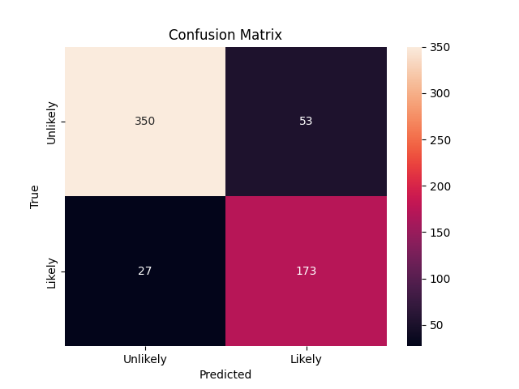
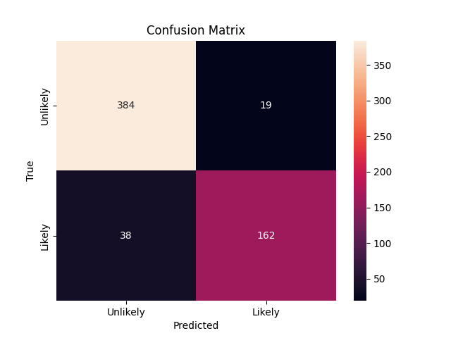

# 🐾 Pet Adoption Likelihood Prediction (Decision Tree Classifier)
This project predicts whether a pet is likely or unlikely to be adopted using a Decision Tree Classifier. I preprocess pet-related features, tune decision tree hyperparameters, and evaluate performance with accuracy, precision, recall, and confusion matrix visualizations.


## 📊 Dataset
Source: Predict Pet Adoption Status Dataset on Kaggle

Target Variable: adoption_likelihood

- 1 → Likely to be adopted

- 0 → Unlikely to be adopted

Features include:

- Age (in months)
- Adoption fee
- Pet weight (kg)
- Size, breed, color, type
- Other categorical descriptors

## 🚀 Project Workflow

1. Data Preprocessing
   
- Removed non-informative columns (pet_id)
- Mapped and encoded categorical features:
- Ordinal mapping for size
- One-hot encoding for color, breed, pet_type
- Scaled numerical features:
- weight_kg → MinMaxScaler
- adoption_fee → StandardScaler
- Visualized feature distributions and class balance

2. Modeling
   
🔹 Baseline Model (Default Decision Tree)

Used default DecisionTreeClassifier from sklearn
- Accuracy: 0.86

Observations:

- Balanced performance across both classes
- Tends to overfit without tuning

🔹 Tuned Model (Custom Hyperparameters)

DecisionTreeClassifier(
    criterion='entropy',
    max_depth=5,
    min_samples_split=10,
    min_samples_leaf=5
)

Accuracy: 0.91

Shows improved generalization and better F1-score for Likely class

## 📈 Confusion Matrix Visualizations
📌 Default Decision Tree Model
Accuracy: 0.86



📌 Tuned Decision Tree Model (After Hyperparameter Optimization)
Accuracy: 0.91



## 🧾 Results Summary

| Model                  | Accuracy | Precision (Likely) | Recall (Likely) | F1-Score (Likely) |
|------------------------|----------|---------------------|------------------|--------------------|
| Default Decision Tree  | 0.86     | 0.75                | 0.88             | 0.81               |
| Tuned Decision Tree    | 0.91     | 0.86                | 0.91             | 0.88               |

## ⚙️ Installation

1. Clone the repo:

```bash
git clone https://github.com/yourusername/pet_adoption_decision_tree.git
cd pet_adoption_decision_tree
```
2. **Install dependencies:**:   
```commandline
pip install -r requirements.txt
```

📂 Files in This Repo

- pet_adoption_decision_tree.ipynb: Full notebook with EDA, preprocessing, modeling, and evaluation.
- requirements.txt: List of required Python packages.
- images/confusion_matrix.png: Confusion matrix of the default model.

images/tuned_confusion_matrix.png: Confusion matrix of the tuned model.

👨‍💻 Author

Yoseph Negash

📧 yosephn22@gmail.com

📅 2025
